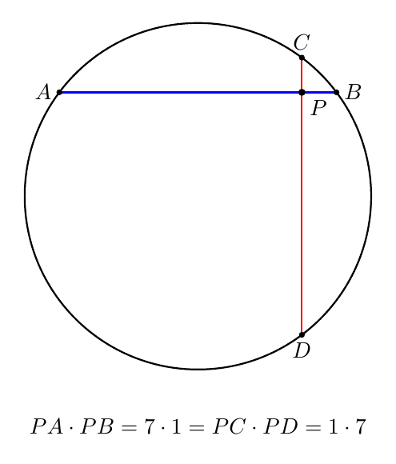
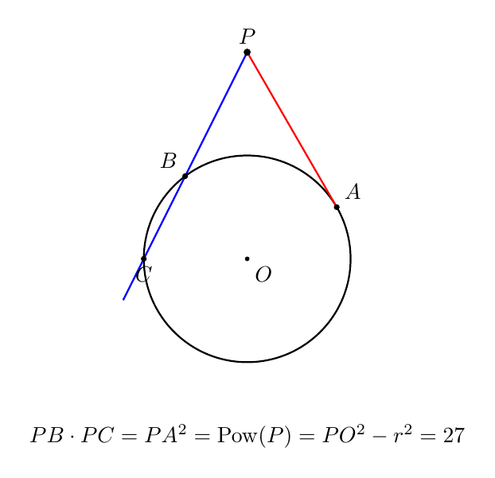
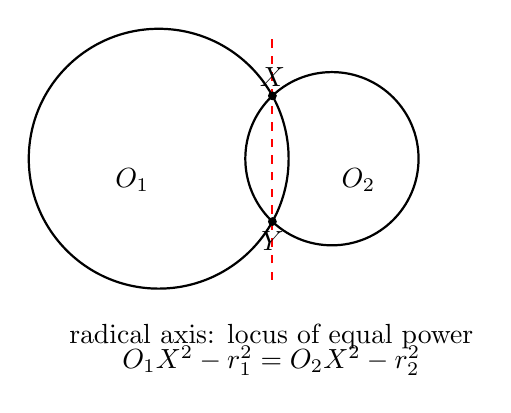
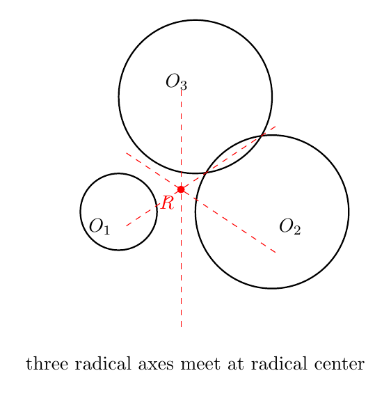
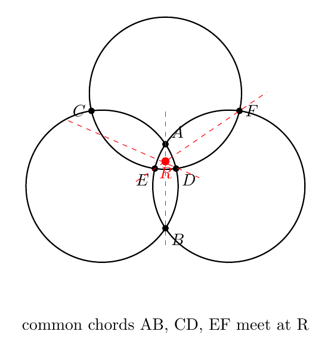
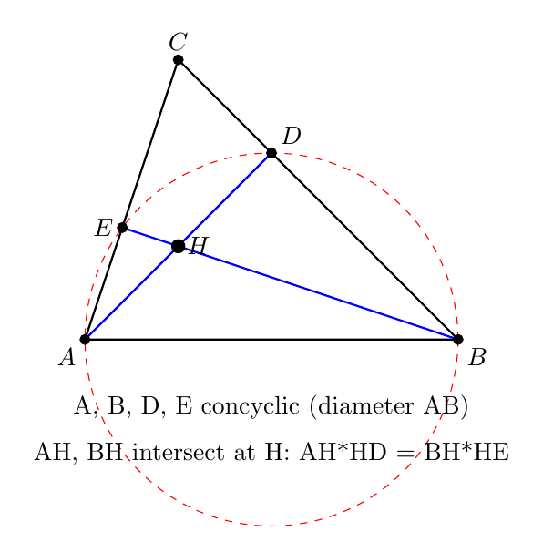
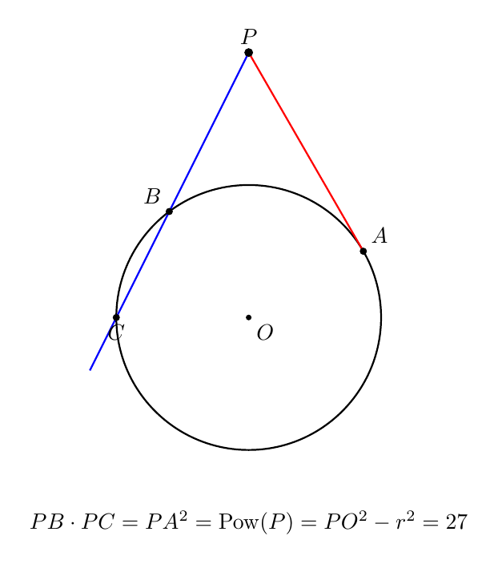
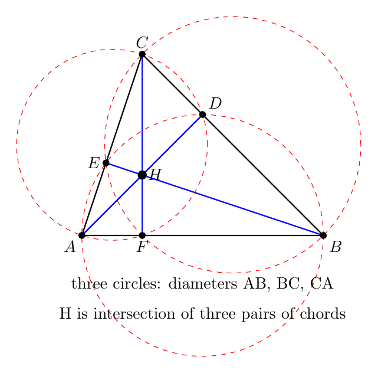

# No20. 圆幂定理与根轴：一杆秤称尽两个圆

> "The power of a point is a measure of how far a point is from a circle."
> 「点到圆的幂，衡量的是这个点离圆有多远。」—— 圆幂定理的现代解读

## 一、破题

设平面上有两个圆。对圆 $O_1$（半径 $r_1$）和圆 $O_2$（半径 $r_2$），一个点 $P$ 到两圆的"距离"如何统一衡量？直觉上这不是一个数能说的——但圆幂定理给出一个绝妙的答案：**$PO_1^2 - r_1^2$ 和 $PO_2^2 - r_2^2$**。这两个数相等，当且仅当 $P$ 在一条直线上——这条直线，就是**根轴**。

先从一个最朴素的问题出发。

**问题**：如图，圆内两条弦 $AB$、$CD$ 交于 $P$。证明：$PA \cdot PB = PC \cdot PD$。

直觉上"两条弦相交，乘积相等"是"大概成立"——但用相似三角形即可严格证明：$\triangle PAC \sim \triangle PDB$（同弧圆周角相等，对顶角相等），所以 $\dfrac{PA}{PD} = \dfrac{PC}{PB}$，即 $PA \cdot PB = PC \cdot PD$。∎

这是相交弦定理。它看似平凡，却是整个圆幂理论的第一块基石。

## 二、圆幂：统一三个定理

把上面的乘积推广到 $P$ 在圆外：

**定义（点到圆的幂）**：点 $P$ 到圆 $O$（半径 $r$）的**幂**为

$$\text{Pow}(P) = PO^2 - r^2.$$

- $P$ 在圆内：幂为负（$PO < r$）
- $P$ 在圆上：幂为 0
- $P$ 在圆外：幂为正（$PO > r$）

**三个经典定理其实是一个**：

| 定理 | 情形 | 表述 |
|------|------|------|
| 相交弦定理 | $P$ 在圆内 | $PA \cdot PB = PC \cdot PD$ |
| 割线定理 | $P$ 在圆外，两条割线 | $PA \cdot PB = PC \cdot PD$ |
| 切割线定理 | $P$ 在圆外，一条割线一条切线 | $PA \cdot PB = PT^2$ |

它们都可以统一写成：

$$\text{Pow}(P) = \text{任意过 } P \text{ 的直线与圆的两交点距离之积（带符号）}.$$

**为什么统一？** 用坐标一算就清楚：圆 $(x-a)^2 + (y-b)^2 = r^2$，点 $P$。过 $P$ 的直线参数化后，两交点对应参数 $t_1, t_2$，而 $t_1 t_2 = \dfrac{PO^2 - r^2}{(\text{方向向量长度})^2}$——**乘积只依赖 $P$ 与圆，不依赖直线方向**。所以无论割线怎么转，乘积恒等于幂。这就是圆幂定理的全部内容。

## 三、根轴：两圆等幂点的轨迹

**定义（根轴）**：对两圆 $O_1, O_2$，满足 $\text{Pow}_{O_1}(P) = \text{Pow}_{O_2}(P)$ 的点 $P$ 的集合。

$$PO_1^2 - r_1^2 = PO_2^2 - r_2^2.$$

**它是一条直线。** 用坐标：$O_1(0,0), r_1$；$O_2(d,0), r_2$。代入得

$$x^2 + y^2 - r_1^2 = (x-d)^2 + y^2 - r_2^2 \;\Longrightarrow\; x = \frac{d^2 + r_1^2 - r_2^2}{2d}.$$

**$x$ 是常数**——所以根轴是垂直于 $O_1O_2$ 的一条直线！

**三个观察**：
1. 若两圆相交于 $X, Y$，则 $X, Y$ 的幂都是 0，等幂——**$X, Y$ 在根轴上**。所以两圆相交时，根轴就是公共弦 $XY$。
2. 两圆相切时，根轴是公切线（切点处幂为 0）。
3. 两圆不相交时，根轴是两圆之间的一条直线——两圆"中间地带"的分界线。

**识别信号**：**"两圆等幂 / 求两圆公共弦 / 证明共线" → 想根轴**。

## 四、根心定理：三根轴共点

**定理（根心）**：三个圆两两的根轴，或者平行，或者交于一点（称为**根心**）。

**证明**：设圆 $1, 2$ 的根轴为 $l_{12}$，圆 $2, 3$ 的根轴为 $l_{23}$，$l_{12}$ 与 $l_{23}$ 交于 $R$。则 $R$ 对圆 1 和圆 2 等幂（在 $l_{12}$ 上），对圆 2 和圆 3 等幂（在 $l_{23}$ 上）。于是 $R$ 对圆 1 和圆 3 也等幂——**$R$ 在圆 1、3 的根轴 $l_{13}$ 上**。∎

三行证明，却把"三个圆的几何"收束成一个点。这是联赛一试里"多圆共点"问题的标准工具。

### 例 1：三个圆的公共弦

三个圆两两相交。证明：三条公共弦共点。

**分析**：两圆相交，公共弦 = 根轴。三条公共弦就是三条根轴，由根心定理，它们共点。∎

一道看起来要画很多辅助线的题，根心定理一句话。这就是"代数化的几何"的威力——**不构造，只算幂**。

## 五、综合题运用

概念讲完了。工具的价值在于解题——下面这些题，全是圆幂/根轴的用武之地。

### 例 2：垂心中的圆幂

**题目**：$\triangle ABC$ 中，$AD \perp BC$ 于 $D$，$BE \perp AC$ 于 $E$，垂心为 $H$。证明：$AH \cdot HD = BH \cdot HE$。

**分析**：看到"两条线段的乘积相等"，第一反应是找**两弦相交**——也就是找四点共圆。这里有四个直角：$\angle ADB = 90°$、$\angle AEB = 90°$——**$A, B, D, E$ 四点共圆**（同侧等角，即都在以 $AB$ 为直径的圆上）。

**证明**：$A, B, D, E$ 共圆，$AH$ 与 $BH$ 是圆内两条相交的弦（交于 $H$）。由相交弦定理：

$$AH \cdot HD = BH \cdot HE.$$

∎

**复盘**：这道题的关键动作是**发现那个"隐藏的圆"**——四个直角 ⟹ 四点共圆 ⟹ 相交弦定理直接命中。圆幂的价值就在这：**它让"找隐藏的圆"变成"找隐藏的乘积等式"**。用程序验证过：取 $A(0,0), B(4,0), C(1,3)$，$AH \cdot HD = BH \cdot HE = 2$ 精确成立。

### 例 3：切割线求乘积

**题目**：圆 $O$ 的半径为 3，点 $P$ 在圆外且 $PO = 6$。过 $P$ 作圆的切线 $PA$（切点 $A$），再过 $P$ 作割线交圆于 $B, C$。求 $PB \cdot PC$。

**分析**：$PO = 6$，$r = 3$——直接算幂：$\text{Pow}(P) = PO^2 - r^2 = 36 - 9 = 27$。由切割线定理，$PB \cdot PC = PA^2 = \text{Pow}(P) = 27$。∎

**复盘**：不用知道割线长什么样、$B, C$ 在哪——**乘积只由 $P$ 与圆决定**，这是圆幂定理最反直觉也最强大的地方。程序验证：割线 $y = 2x + 6$ 与圆交于 $B(-1.8, 2.4), C(-3, 0)$，$PB \cdot PC = 27.000$，精确成立。

### 例 4：根轴求切线长

**题目**：两圆 $O_1, O_2$ 的根轴为 $l$。$l$ 上一点 $P$ 分别作两圆的切线，切点为 $T_1, T_2$。证明：$PT_1 = PT_2$。

**分析**：切线长公式 $PT^2 = PO^2 - r^2$——**切线长的平方就是幂**！$P$ 在根轴上，对两圆等幂：

$$PT_1^2 = PO_1^2 - r_1^2 = PO_2^2 - r_2^2 = PT_2^2.$$

**两边都是正数，开方得 $PT_1 = PT_2$。** ∎

**复盘**：根轴的定义（等幂）直接翻译成"切线长相等"——**根轴上的点到两圆的切线一样长**，这就是根轴的"几何意义"。一条定义，三种读法：等幂 / 公共弦 / 等切线长。

### 例 5：三垂足的圆幂

**题目**：$\triangle ABC$ 中，$D, E, F$ 分别是三边上的垂足，$H$ 为垂心。证明：

$$AH \cdot HD = BH \cdot HE = CH \cdot HF.$$

**分析**：例 2 我们证明了 $A, B, D, E$ 共圆（以 $AB$ 为直径），于是 $AH \cdot HD = BH \cdot HE$。现在"如法炮制"两次：

**证明**：
- $A, B, D, E$ 共圆（$\angle ADB = \angle AEB = 90°$），$AH$ 与 $BH$ 交于 $H$：$AH \cdot HD = BH \cdot HE$
- $B, C, E, F$ 共圆（$\angle BEC = \angle BFC = 90°$，以 $BC$ 为直径），$BH$ 与 $CH$ 交于 $H$：$BH \cdot HE = CH \cdot HF$

三式首尾相接：$AH \cdot HD = BH \cdot HE = CH \cdot HF$。∎

**复盘**：这道题的结构是**三次套用同一个模板**（直角 → 共圆 → 相交弦）——第一次是"发现"，后两次是"复制"。高联几何里很多题就是这样：一个漂亮的想法，连用三次，就成了一整道压轴题。程序验证（$A(0,0), B(4,0), C(1,3)$）：三个乘积都精确等于 2。

### 例 6：切割线与切线长互求

**题目**：圆 $O$ 半径 3，$P$ 在圆外且 $PO = 6$，$PA$ 是切线。过 $P$ 作割线交圆于 $C, D$，且 $PC = 4$（$C$ 靠近 $P$）。求 $PD$。（图 7 中把 $B, C$ 换名为 $C, D$ 即本题图形。）

**分析**：$PC$ 已知，$PD$ 未知，但 $PC \cdot PD = PA^2 = 27$（切割线定理）——一个方程一个未知数：

**求解**：$4 \cdot PD = 27$，所以 $PD = \dfrac{27}{4} = 6.75$。∎

**复盘**：这道题展示了圆幂定理的"代数化"威力——**不需要画出 $D$ 在哪，乘积等式直接给出答案**。$PC=4$ 是 $P$ 到圆近点距离，$PD=6.75$ 是远点距离，二者乘积恒等于幂 27。识别信号：**"切割线 + 一段线段已知" → 圆幂列方程**。（数值验证：$PC \ge PO - r = 3$，割线确实存在。）

## 六、启发与一般化

圆幂定理与根轴，是"几何代数化"的典范：

1. **乘积 → 幂**：把"两线段乘积相等"抽象成"点到圆的幂"，三条定理合一
2. **幂 → 等幂 → 直线**：两圆等幂点构成一条直线（根轴），几何变成了坐标算
3. **三条根轴 → 一个点**：根心定理把多圆问题收束

**识别信号速查**：

| 看到什么 | 想到什么 |
|---------|---------|
| 圆内两弦相交 / 圆外两条割线 / 割线+切线 | 圆幂（$PA\cdot PB = \cdots$） |
| 两圆公共弦 / 两圆等幂点 | 根轴 = 公共弦 |
| 三圆两两相交，证公共弦共点 | 根心定理 |
| 证明线段乘积相等 | 圆幂（找过两交点的圆） |

**与系列的关系**：圆幂的"统一"精神与 No7 柯西（多个定理一个结构）、No19 奇偶性（多个问题一个工具）一脉相承。而根轴把几何问题变成"算 $PO^2 - r^2$"，是联赛一试里"代数化"的最佳示范。

**一个提醒**：圆幂定理用相似三角形可证（同弧圆周角），但它真正的威力在**统一**——三个定理一个幂，多圆问题一条根轴。记住"幂"这个抽象，比记住三个定理更值钱。

## 八、教学研究后记

学生第一次接触圆幂，常觉得"相交弦、割线、切线"是三个定理，要背三个。根轴更是"没见过"的新概念。教学的关键是把三合一：**让学生自己推导一次**——取圆 $(x-a)^2+(y-b)^2=r^2$ 和过 $P$ 的直线，算两交点参数之积，发现它与直线方向无关。这个"算一次"的动作，比背三遍定理更有用。

根轴难在抽象（"等幂点的轨迹"），但一旦画出来（两圆中间那条直线），学生立刻懂。**教学顺序建议**：先相交弦（具体）→ 再圆幂定义（抽象）→ 最后根轴（轨迹）——从具体到抽象，学生才跟得上。

## 九、数学史小记

（本节与正文解耦，简述圆幂的历史。）

圆幂的思想可以追溯到古希腊。欧几里得《几何原本》第三卷已有相交弦、割线定理的雏形；Ptolemy（托勒密）在《天文学大成》里用割线定理计算弦长（正弦表的前身）。"圆幂"（power of a point）这个术语由法国数学家 Steiner（斯坦纳）在 19 世纪引入——他把"点到圆的幂"抽象成一个独立概念，并由此发展出根轴、根心的理论。Steiner 一生没有上过正规大学，却在几何学上留下了最深刻的名字之一。从 Euclid 到 Steiner，从具体线段到抽象幂——"统一"的冲动，是几何学最持久的动力。

## 思考题

**问题 1（★★☆☆☆）**：圆外一点 $P$ 到圆的两条切线长分别为 5 和 5（两条切线长度相等是切线定理）。若 $PO = 13$，求圆的半径。（提示：切线长 $= \sqrt{PO^2 - r^2}$——幂的几何意义。）

**问题 2（★★★☆☆）**：三个圆两两相交，交点分别为 $A, B$；$C, D$；$E, F$。证明：三条公共弦 $AB, CD, EF$ 共点。（提示：公共弦 = 根轴，用根心定理。）

**问题 3（★★★★☆）**：$\triangle ABC$ 中，$\angle A = 90°$，$AD$ 是斜边上的高。证明：$AD^2 = BD \cdot CD$。（提示：$A$ 在以 $BC$ 为直径的圆上（直径所对圆周角），$D$ 在圆内。弦 $BC$ 与弦 $AD$ 的延长线交圆于 $E$——由相交弦定理 $BD \cdot CD = AD \cdot DE$；再验证 $D$ 是 $AE$ 的中点（射影定理的几何本质）。这就是著名的射影定理，圆幂给了它一个一句话证明。）

---

*发表于 2026-08 · 几何系列 No.20*
