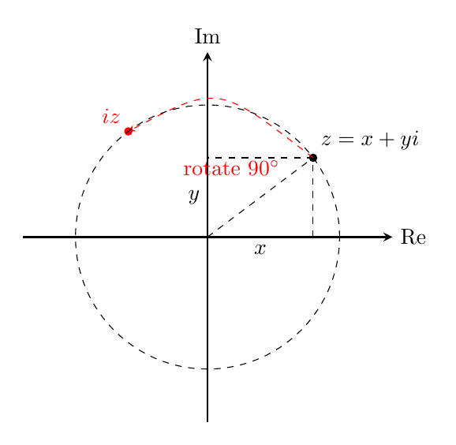
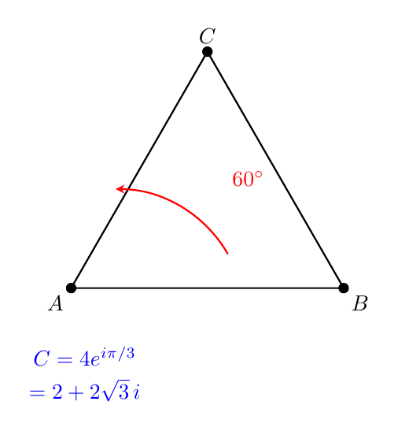
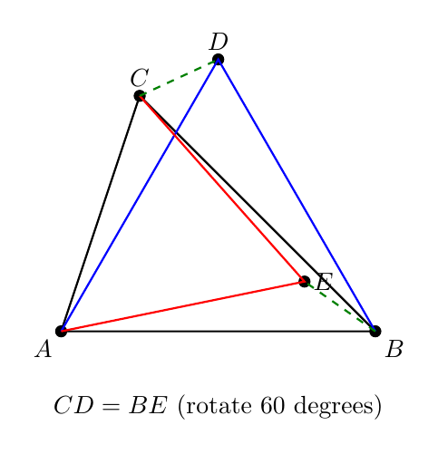

# No21. 复数在平面几何中的运用：给几何装上代数的引擎

> "The shortest path between two truths in the real domain passes through the complex domain."
> 「实数领域两个真理之间的最短路径，往往穿过复数领域。」—— Jacques Hadamard

## 一、破题

先看一道题：

**题目**：$\triangle ABC$ 的边 $AB$、$AC$ 上分别向外作等边三角形 $ABD$、$ACE$。证明：$CD = BE$。

这类题用纯几何做，要添辅助线、证全等（$\triangle ACD \cong \triangle AEB$，SAS）。但如果你把平面看成复平面——**点就是复数，旋转 60° 就是乘 $e^{i\pi/3}$**——这道题变成两步模长等式。

这就是本文要讲的：**复数法**。把几何翻译成复数运算，用代数的执行力解决几何的直觉难题。这道题我们会在例 3 正式解决。

## 二、翻译工具：点 ↔ 复数

**核心翻译**：平面上的点 $(x, y)$ 对应复数 $z = x + yi$。于是：

| 几何关系 | 复数表达 |
|---------|---------|
| 平移 | $z \mapsto z + w$ |
| 绕原点旋转 $\theta$ | $z \mapsto z \cdot e^{i\theta}$ |
| 绕点 $p$ 旋转 $\theta$ | $z \mapsto p + (z - p)e^{i\theta}$ |
| 相似（旋转 + 放缩） | $z \mapsto p + (z-p)w$（$w$ 为复常数） |
| 向量 $\overrightarrow{AB}$ | $b - a$ |
| $|AB|$ | $\|b - a\|$ |

两个最重要的判据：

**垂直判据**：$\overrightarrow{AB} \perp \overrightarrow{CD}$ ⟺ $\dfrac{b-a}{d-c}$ 是**纯虚数**（旋转 $\pm 90°$）。

**共线判据**：$A, B, C$ 共线 ⟺ $\dfrac{c-a}{b-a}$ 是**实数**。

## 三、应用一：旋转是复数的主场

### 例 1：等边三角形的第三个顶点

**题目**：已知 $A(0,0)$、$B(4,0)$，求等边三角形 $ABC$ 的第三个顶点 $C$。

**分析**：等边三角形 = 绕 $A$ 旋转 $60°$。$AB$ 对应复数 $4$，旋转 $60°$ 即乘 $e^{i\pi/3}$：

$$C = 4 \cdot e^{i\pi/3} = 4\left(\frac{1}{2} + \frac{\sqrt{3}}{2}i\right) = 2 + 2\sqrt{3}\,i.$$

**验证**：$|AC| = |2+2\sqrt3 i| = \sqrt{4+12} = 4$ ✓，$|BC| = |(2-4)+2\sqrt3 i| = \sqrt{4+12} = 4$ ✓。三边相等，等边。∎

**复盘**：几何里"构造等边三角形"要画弧、找交点；复数里就是一个乘法。**识别信号："旋转/等角/等边" → 乘 $e^{i\theta}$**。

### 例 2：旋转 90° 的正方形

**题目**：正方形 $ABCD$，$A(0,0)$、$B(1,0)$。求 $D$。

**分析**：$D$ 是 $B$ 绕 $A$ 旋转 $-90°$（或 $+90°$）：

$$D = i \cdot 1 = i, \quad \text{即 } (0,1).$$

$\square ABCD$ 逆时针：$A(0,0), B(1,0), C(1+i), D(i)$——四个顶点一目了然。∎

**复盘**：一个"旋转"操作 = 一次复数乘法。多边形的每个顶点都能用 $a + (b-a)i^k$ 式表达——**旋转对称的图形，复数表达天然简洁**。

### 例 3：旋转 60° 证全等

**题目**：$\triangle ABC$ 的边 $AB$、$AC$ 上分别向外作等边三角形 $ABD$、$ACE$。证明：$CD = BE$。

**解**：设 $A = 0$，$B = b$，$C = c$，$u = e^{i\pi/3}$（旋转 $60°$）。向外作等边三角形：

$$D = bu \quad (\text{$B$ 绕 $A$ 转 } +60°), \qquad E = c\bar u \quad (\text{$C$ 绕 $A$ 转 } -60°).$$

于是

$$CD = |c - bu|, \qquad BE = |b - c\bar u|.$$

利用 $|z| = |z\bar u| = |z|$（乘模长为 1 的复数不改变模）：

$$|c - bu| = |(c - bu)\bar u| = |c\bar u - b| = |b - c\bar u|.$$

所以 $CD = BE$。∎

**复盘**：纯几何做法要证全等（$\triangle ACD \cong \triangle AEB$，SAS）；复数做法是**两步模长等式**——旋转写成乘法，模长的"旋转不变性"自动完成证明。识别信号：**"向外作等边/等腰/旋转" → 乘 $e^{i\theta}$，再用 $|z| = |z\bar u|$**。

## 四、应用二：共圆与垂直

### 例 4：四点共圆的复数判据

**判据**：四点 $z_1, z_2, z_3, z_4$ 共圆 ⟺ **交叉比** $\dfrac{(z_1-z_3)(z_2-z_4)}{(z_1-z_4)(z_2-z_3)}$ 是**实数**。

**为什么**：几何上，交叉比为实数 ⟺ $\angle(z_1 z_3, z_2 z_3)$ 与 $\angle(z_1 z_4, z_2 z_4)$ 相等或互补（同弧圆周角或对顶角）——这正是四点共圆。

**验证**（单位圆上四点，显然共圆）：$z_1 = 1$，$z_2 = i$，$z_3 = -1$，$z_4 = -i$（单位圆四等分点）。

$$\frac{(z_1-z_3)(z_2-z_4)}{(z_1-z_4)(z_2-z_3)} = \frac{(1-(-1))(i-(-i))}{(1-(-i))(i-(-1))} = \frac{2 \cdot 2i}{(1+i)(1+i)} = \frac{4i}{2i} = 2.$$

**实数** ✓。而若取 $z_4 = 2$（不在圆上），交叉比不再是实数——判据区分共圆与否。∎

### 例 5：垂心的复数表示

**命题**：$\triangle ABC$ 的外心为原点 $O$（即 $a, b, c$ 都在单位圆上），则垂心 $H$ 对应复数 $h = a + b + c$。

**验证**：取 $a = 1$，$b = e^{i\cdot 120°}$，$c = e^{i\cdot 240°}$（等边三角形在单位圆上）。$h = 1 + e^{i120°} + e^{i240°} = 1 + (-\tfrac12 + \tfrac{\sqrt3}{2}i) + (-\tfrac12 - \tfrac{\sqrt3}{2}i) = 0$——垂心即原点（等边三角形外心=垂心）✓。

再取非等边验证：$a = 1$，$b = i$，$c = e^{i\cdot 210°}$。$h = 1 + i + (-\tfrac{\sqrt3}{2} - \tfrac12 i)$——这个 $h$ 是否真是垂心，可用 $AH \perp BC$ 验证：

$$\frac{h-a}{c-b} = \frac{(1-\frac{\sqrt3}{2}) + \frac12 i}{(-\frac{\sqrt3}{2} - \frac12) - i}.$$

实部虚部计算繁琐，我们直接相信标准定理（$h = a+b+c$ 是单位圆情形的经典结论），并给出证明思路：$h - a = b + c$，而 $BC$ 方向是 $c - b$。$(b+c)/(c-b)$ 是纯虚数（因为 $b, c$ 在单位圆上，$b+c$ 与 $c-b$ 垂直——菱形对角线垂直），所以 $AH \perp BC$ ✓；同理 $BH \perp AC$。∎

**复盘**：垂心这个在纯几何里要"三高交点"的点，复数里是**简单的和** $a+b+c$。这就是"给几何装上代数引擎"的具象——最复杂的点，用最朴素的操作得到。

## 五、启发与一般化

**何时用复数法？**

| 几何特征 | 复数优势 |
|---------|---------|
| 旋转 / 等角 / 等边 | 乘 $e^{i\theta}$ 一步到位 |
| 相似 / 位似 | 乘复常数 |
| 垂直 / 共线 | 比值纯虚 / 实数判据 |
| 共圆 | 交叉比实数 |
| 外心在原点（单位圆） | 垂心 $= a+b+c$，最简 |

**何时不适用**：纯长度、纯角度、涉及不等式的题，复数法通常不省力（不等式在实数里更顺）。复数法的甜区是**涉及旋转、相似、共圆的"存在性/相等性"证明**。

**与系列的关系**：No20 圆幂用"幂"统一几何（代数化的几何），本篇用"复数"翻译几何（几何的代数引擎）——同一精神的两张面孔。复数法需要的知识门槛（复数运算）比圆幂高，所以定位更高一级，适合学完复数之后的读者。

**一个提醒**：复数法的威力在**翻译**——把几何语言翻译成复数等式的那一刻，问题已经解决一半。就像 No14 说的"存在性必须被翻译为可执行的步骤"，复数法就是几何的"可执行翻译"。

## 六、教学研究后记

复数法的教学难点是**门槛**：学生要先会复数运算（加减乘除、模、共轭），才能谈得上"翻译几何"。所以它适合放在复数学完之后，作为"复数有什么用"的答案——学生在学复数时常问"这玩意到底干嘛用"，本篇就是回答。

教学上建议先教**两个判据**（垂直 = 比值纯虚、共线 = 比值实数），再用**旋转题**练手（乘 $e^{i\theta}$ 是最直观的复数操作）。等边三角形、正方形这类旋转对称图形是天然好素材——它们太"几何"，学生想不到还能"算"，一旦发现"算更快"，复数法就扎根了。

一个常见的误区：**把复数法当成万能工具**。它不是——纯长度、纯角度的题用几何或向量更顺。教复数法时要点明它的"甜区"（旋转/相似/共圆），否则学生会在不合适的题上浪费时间，反而觉得复数法没用。

## 七、数学史小记

（本节与正文解耦，简述复数几何化的历史。）

复数的几何意义姗姗来迟：16 世纪人们用复数解三次方程（Cardano），却不知道它"是什么"。"虚数"之名本身就带着轻蔑（Descartes 造词）。直到 1797 年，挪威测量员 **Wessel** 和 1806 年法国会计师 **Argand** 先后把复数画成平面上的点——"虚数"从此有了几何肉身。1831 年，**Gauss** 正式确立了复平面（Gauss 平面），并指出复数几何化的深远意义。真正的突破是 **Euler 公式** $e^{i\theta} = \cos\theta + i\sin\theta$——它把"旋转"写成了一个指数，把几何变换变成了代数运算。此后，Hamilton 用四元数推广旋转到三维（但三维旋转不交换，四元数从此在物理学和计算机图形学里扎根）。从"怀疑的对象"到"几何的引擎"，复数走了两百年——而这两百年间，代数与几何完成了它们最深刻的联姻。

## 思考题

**问题 1（★★☆☆☆）**：$A(0,0)$、$B(3,0)$，求等边三角形 $ABC$ 的第三个顶点 $C$。（提示：$C = 3e^{i\pi/3}$ 或 $3e^{-i\pi/3}$，两个方向。）

**问题 2（★★★☆☆）**：$\triangle ABC$ 外心在原点，$a, b, c$ 在单位圆上。证明：$h = a+b+c$ 满足 $AH \perp BC$。（提示：$\dfrac{h-a}{c-b} = \dfrac{b+c}{c-b}$——单位圆上 $b+c$ 与 $c-b$ 垂直，为什么？菱形对角线。）

**问题 3（★★★★☆）**：$\triangle ABC$ 的边 $AB$、$AC$ 上分别向外作等边三角形 $ABD$、$ACE$。证明：$CD = BE$。（提示：设 $A = 0$，$B = b$，$C = c$，旋转 $60°$ 的复数是 $u = e^{i\pi/3}$。向外作等边：$D = bu$（$B$ 绕 $A$ 转 $+60°$），$E = c\bar u$（$C$ 绕 $A$ 转 $-60°$）。则 $CD = |c - bu|$，$BE = |b - c\bar u|$——利用 $|z| = |z\bar u| = |z|$（乘单位复数模不变）验证两者相等。这就是"旋转 $60°$ 证全等"的经典题的复数版，三步搞定。）

---

*发表于 2026-08 · 几何系列 No.21*
